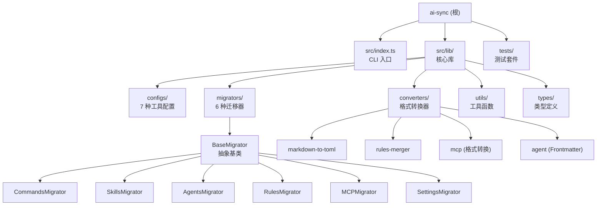

# ai-sync - AI 工具配置迁移 CLI

## 项目愿景

**ai-sync** (`@jl-org/ai-sync`) 是一个 TypeScript CLI 工具，以 Claude Code 配置（`~/.claude/`）为唯一标准源，自动化将 Commands、Skills、Agents、Rules、MCP、Settings 迁移到 Cursor、OpenCode、Gemini CLI、IFlow CLI、Codex、CodeBuddy 等 AI 工具。支持交互式与命令行两种模式，支持用户自定义工具扩展（`ai-sync.config.js` / `defineConfig`）。

## 架构总览

## 模块索引

本项目为单体仓库（非 mono-repo），以下按功能模块分组：

| 模块 | 路径 | 职责 |
|------|------|------|
| **CLI 入口** | `src/index.ts` | 解析命令行参数 / 交互式向导，协调迁移流程 |
| **配置中心** | `src/lib/config.ts` | 导出 `INTERNAL_CONFIG`、`defineConfig`、工具支持检测 |
| **工具配置** | `src/lib/configs/` | 7 种工具（cursor / claude / codebuddy / opencode / gemini / iflow / codex）的路径和转换规则定义 |
| **迁移器** | `src/lib/migrators/` | 模板方法模式，`BaseMigrator` 抽象基类 + 6 种子类（Commands / Skills / Agents / Rules / MCP / Settings） |
| **转换器** | `src/lib/converters/` | Markdown-to-TOML、Rules 合并、MCP 格式转换（OpenCode / Gemini / Codex）、Agent Frontmatter 处理 |
| **用户配置** | `src/lib/customConfig.ts` | 加载 `ai-sync.config.js` / `package.json["ai-sync"]`，与内置配置深度合并 |
| **路径工具** | `src/lib/path.ts` | `~` 展开、源路径探测、目标路径动态解析（支持数组探测） |
| **类型定义** | `src/lib/types/config.ts` | `ToolKey`、`ConfigType`、`ToolConfig`、`SyncConfig` 等核心类型 |
| **工具函数** | `src/lib/utils/` | 文件操作（`file.ts`）、日志（`logger.ts`）、深度合并（`deepMerge.ts`） |
| **测试** | `tests/` | 单元测试 + 集成测试，覆盖配置加载、路径解析、Agent 转换、文件操作、端到端迁移链路 |

## 运行与开发

| 命令 | 说明 |
|------|------|
| `pnpm dev` | 以 `tsx` 运行 CLI（开发模式） |
| `pnpm build` | tsup 构建，输出 CJS + ESM + dts 到 `dist/` |
| `pnpm test` | Vitest 运行所有测试 |
| `pnpm test:watch` | 测试监听模式 |
| `pnpm test:ui` | Vitest UI 界面 |
| `pnpm test:coverage` | 覆盖率报告（v8 provider） |
| `pnpm test:integration` | 仅运行集成测试 |
| `pnpm lint` | ESLint 修复（@antfu/eslint-config） |
| `pnpm typecheck` | TypeScript 类型检查 |
| `pnpm help` | 打印 CLI 帮助信息 |

**技术栈**：TypeScript 5.9 + Node.js 20+ (ESM) + pnpm + tsup + Vitest 4 + ESLint (@antfu)

**路径别名**：

| 别名 | 实际路径 |
|------|---------|
| `@lib/*` | `./src/lib/*` |
| `@utils/*` | `./src/lib/utils/*` |

**构建入口**（tsup.config.ts）：
- `cli` → `src/index.ts`（CLI 可执行入口，`bin.ai-sync`）
- `index` → `src/lib/index.ts`（库公共 API 导出）

**依赖**：
- **运行时**：`@iarna/toml`（TOML 解析/生成）、`chalk`（终端着色）、`inquirer`（交互式提示）、`ora`（加载动画）、`strip-json-comments`（JSONC 支持）、`yaml`（YAML/Frontmatter 解析）

## 测试策略

- **框架**：Vitest 4，`globals: true`，Node 环境
- **测试文件**：`tests/**/*.test.ts`
- **覆盖率**：v8 provider，排除 `node_modules/`、`dist/`、`*.test.ts`、`types/`
- **单元测试**：
  - `config.test.ts` — 工具列表、配置类型支持检测
  - `path.test.ts` — `~` 展开、路径规范化、`getToolPath`
  - `file.test.ts` — 文件操作（mock `fs/promises`）
  - `agent.test.ts` — Agent Frontmatter 转换
  - `opencode.test.ts` — OpenCode Agent transform 验证
  - `customConfig.test.ts` — `defineConfig`、配置合并、`ai-sync.config.js` 加载
  - `path_source.test.ts` — 源路径探测优先级
- **集成测试**：
  - `integration.test.ts` — 端到端迁移链路，mock `homedir` 到 `test-output/`，验证 Commands/Skills/Rules/MCP 对所有工具的完整迁移、覆盖/合并策略、格式转换准确性

## 编码规范

- **格式**：无分号、两格缩进、单引号
- **导出**：避免 `export default`，用具名导出 + `index.ts` 桶导出
- **三元**：多行编写（自定义 ESLint 规则 `forceTernary`）
- **注释**：中文或 `NOTE:` 开头的注释自动转换为文档注释（`docComment` 规则）
- **类型**：严格 TS（`strict: true`），导出的 `type/interface` 提供 JSDoc
- **设计模式**：迁移器使用**模板方法模式**（`BaseMigrator.migrate()` → `migrateForTool()`），配置驱动（`ToolConfig` 声明式）

## AI 使用指引

- 添加新工具支持时：在 `src/lib/configs/` 创建配置文件，在 `src/lib/configs/index.ts` 注册，必要时在 `src/lib/converters/` 添加转换逻辑
- `src/lib/index.ts` 是库公共 API 的统一出口，新增公共模块需在此导出
- 源配置标准为 Claude Code（`~/.claude/`），所有迁移以此为唯一来源
- MCP 转换规则因工具而异（OpenCode 用数组 `command`、Gemini 用 `httpUrl`、Codex 用 TOML `mcp_servers`），修改前务必参考 `AGENTS.md` 的对比表
- 测试中使用 `test-data/` 作为固定源数据，`test-output/` 作为临时目标目录

---

## 项目规范
优先参考项目配置文件（`package.json`、`vite.config.js` 等），mono-repo 注意 `pnpm-workspace.yaml`。这些是理解技术栈的唯一真实来源，不要基于通用知识假设

- 包管理：默认 pnpm
- 技术栈：JS 项目默认 TypeScript + Vite（已有其他构建工具则忽略）
- 路径别名：检查 `tsconfig.json` 的 `paths` 配置

## 代码风格
- 格式：无分号、两格缩进、单引号
- 变量：不可变用 `const`
- 三元：多行编写
- 导出：避免 `export default`，用具名导出，可创建 `**/index.ts` 统一导出
- 类型：类型定义放在底部，确保不影响代码阅读
- 避免不必要的抽象层

## 代码质量
- 设计原则：SRP、OCP、LSP、ISP、DRY、KISS、避免硬编码
- 类型：严格 TS 类型，导出的 `type`/`interface` 提供 JSDoc（含 `@default`），TS 中 JSDoc 无需类型信息
- 运行 TS：用 `tsx`（已全局安装：`npm i tsx -g`）

## 组件设计
- 避免硬编码：通过 props/slots/children 暴露可变部分
- 单一职责：只负责 UI 渲染与交互，不掺杂业务数据/状态管理
- 最大化可控性：插槽、回调、受控模式
- 无副作用：不直接操作 DOM/全局状态/路由，依赖通过 props 注入
- 样式：TailwindCSS，支持 className/style 覆盖
- 组合优于继承
- 动画：自然流畅 motion/react(React) | motion-v(Vue)，UI 简洁冷静（参考 Vercel、Grok、Lovable）

## 文档与交互
- 代码即文档：函数加文档注释，复杂逻辑说明流程，文件开头说明作用
- 文本格式：英文用空格隔开，markdown 特殊词用斜体、重点加粗、两格缩进，多用表格
- 语言：永远中文回答（除非明确要求其他语言），搜索优先英文
- 安全：私密数据放环境变量并提示用户填写
- 行为：不确定时用 `// @TODO` 占位或提问，禁止编造函数/API，优先检索英文资料
- git：严禁执行 git 命令，除非用户明确说明

## Skill 自动读取
处理以下情况时，**先读取**对应 skill 再执行

| 情况 | Skill | 定义 |
|------|--------|------|
| 编写 React（组件、Hooks、TSX 等） | react | `skills/react/SKILL.md` |
| 编写 Vue（组件、SFC、组合式 API 等） | vue | `skills/vue/SKILL.md` |
| 编写 UI 设计（html、tsx、jsx、vue 页面/样式） | ui-design | `skills/ui-design/SKILL.md` |
| 查询或操作 GitHub（仓库、文件、分支、Issue/PR） | github | `skills/github/SKILL.md` |
| 查文档、搜代码示例、联网检索 | search | `skills/search/skill.md` |
| 浏览器查询等数据获取、自动化操作 | agent-browser | `skills/agent-browser/SKILL.md` |

## 搜索
- github 使用 `gh` cli 搜索
- 代码示例等使用 `gh-grep-mcp`
- 文档搜索使用 `ref-mcp`、`context7-mcp`
- 联网搜索使用 `search-mcp`

## 变更记录 (Changelog)

| 时间 | 操作 | 说明 |
|------|------|------|
| 2026-02-28 13:24:59 | 初始化架构文档 | 首次全仓扫描，生成项目愿景、架构总览、模块索引、运行开发、测试策略、编码规范、AI 使用指引 |
| 2026-03-04 17:00:00 | 双向适配规则引擎 | 在 adapt-rules.ts 添加 claude 条目实现 codex→claude 反向替换规则；smart-adapt.ts 取消 claude 跳过逻辑；rules.ts 硬编码改用 adaptContent；测试 130→130 全通过 |
| 2026-03-08 20:00:00 | Skills 集中管理 + 链接引用 | 子目录级 skills 集中管理（`~/.agents/skills/`）；新增 `createDirectoryLink`/`isSymlinkOrJunction`/`removeLink` 工具函数；SkillsMigrator 重写支持 syncSkillsToCentral + migratePerSkill + isSkillTransformNoOp；smart-adapt 跳过 useLink 工具的 transform 注入；新增 15 个测试，共 153 个全通过 |
